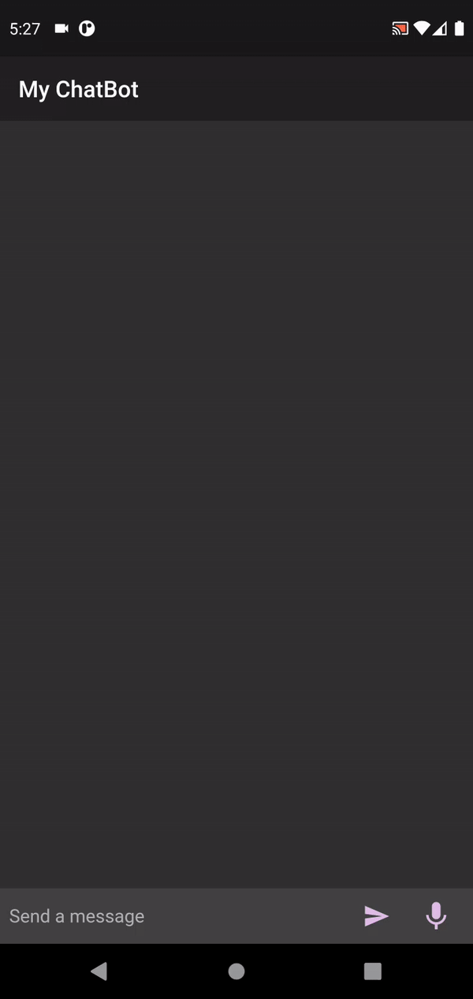

# Build a ChatBot with Flutter & DialogFlow 

This source code is to be used for "Build a chatbot with Flutter & DialogFlow" workshop
The following code is based on CodeLab https://codelabs.developers.google.com/codelabs/dialogflow-flutter#0 

## ScreenShot

## Getting Started

To run the following project you will need to add credentials.json in the assets folder you can generate this file for GCP DialogFlow API keys
